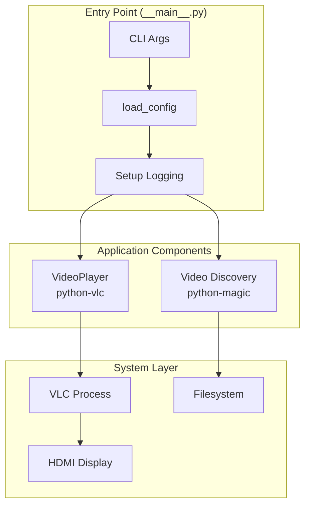

# Architecture

## Design Pattern

Single-process application with an event-driven polling loop. VLC playback managed via `python-vlc` bindings. Video discovery and configuration separated for testability.

## System Architecture

## Playback Loop

VLC is instantiated once. The main thread polls `player.get_state()` to detect end-of-media, then optionally sleeps and replays:

1. `set_media(media)` → `play()`
2. Poll until `State.Ended`
3. `stop()` → optional `sleep(seconds)`
4. Repeat from 1

## Key Design Decisions

- **VLC replaces OMXPlayer** — works on all Pi OS versions, not just Buster
- **MIME-based detection** — python-magic (libmagic) not file extensions
- **CLI overrides config** — TOML provides defaults, flags override at runtime
- **Lazy VLC import** — catches ImportError/OSError for clear error message
- **Package-relative video dir** — `Path(__file__).parent / "video"` not CWD
