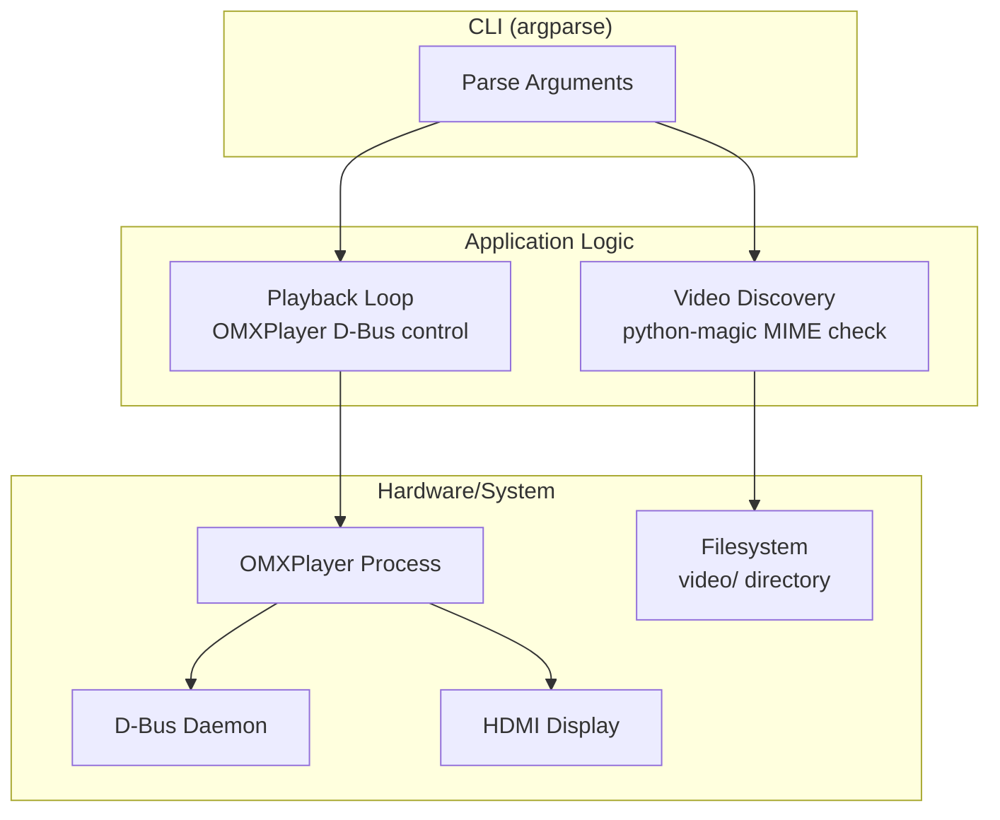

# Architecture

## Design Pattern

Single-file procedural script. No classes, no service layers. Functions called sequentially from `if __name__ == "__main__"` block.

## System Architecture

## Execution Modes

| Mode | Flag | Behavior |
|------|------|----------|
| Specific video | `-v PATH` | Loop a single specified video file |
| Random video | `-r` | Pick random video from `./video/` directory |
| Test mode | `-t` | Windowed 720×360 instead of fullscreen |
| Sleep between loops | `-s MINUTES` | Pause between loop iterations |

## Playback Loop Pattern

OMXPlayer is instantiated once with `--loop` flag, then controlled via D-Bus:
1. `player.pause()` — start paused
2. `player.play()` — begin playback
3. `sleep(player.duration())` — wait for video to finish
4. `player.pause()` — pause at end
5. `player.set_position(0.0)` — seek to start
6. Optional sleep between loops
7. Repeat

This avoids OMXPlayer process restart overhead between loops.

## Key Design Decisions

- **MIME-based file detection** — uses libmagic rather than file extensions for video identification
- **OMXPlayer with D-Bus** — hardware-accelerated video on Pi, controlled programmatically
- **CWD-relative video path** — `os.path.abspath("video")` resolves from current working directory
- **Orientation hardcoded to 180°** — display mounted upside-down in production mode
- **Fatal errors use `sys.exit()`** — no exception propagation
