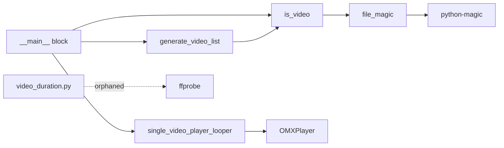

# Components

## Main Module (`app/halloween_video_player_looper.py`)

### `current_time()`
Returns formatted datetime string (`%Y-%m-%d %H:%M:%S`). Used for log-style print output.

### `file_magic(file_path)`
Returns `(file_type, mime_type)` tuple using `python-magic` (libmagic wrapper).

### `is_video(file_path)`
Returns `True` if the file's MIME type contains "video".

### `generate_video_list(video_dir)`
Walks a directory tree, filters for video files using MIME detection. Returns list of video file paths. Exits fatally if directory missing or no videos found.

**Default video_dir**: `os.path.abspath("video")` — relative to CWD, not package.

### `single_video_player_looper(video_clip_path, sleep_minutes, test_mode)`
Core playback loop. Instantiates OMXPlayer once, then loops:
- play → sleep(duration) → pause → seek(0) → optional sleep → repeat
- Handles `KeyboardInterrupt` for graceful exit
- Test mode: 720×360 window; Production: fullscreen, 180° rotation, fill aspect

### `__main__` block
Parses CLI args, validates input, dispatches to `single_video_player_looper()`.

## Orphaned Utility (`app/video_duration.py`)

### `video_dir()`
Returns path to `video/` subdirectory relative to the script file.

### `video_duration_ffprobe(file_path)`
Calls `ffprobe` subprocess to get video duration in seconds. Returns string.

**Note**: This module is never imported by the main application. It appears to be a standalone development utility.

## Component Relationships

