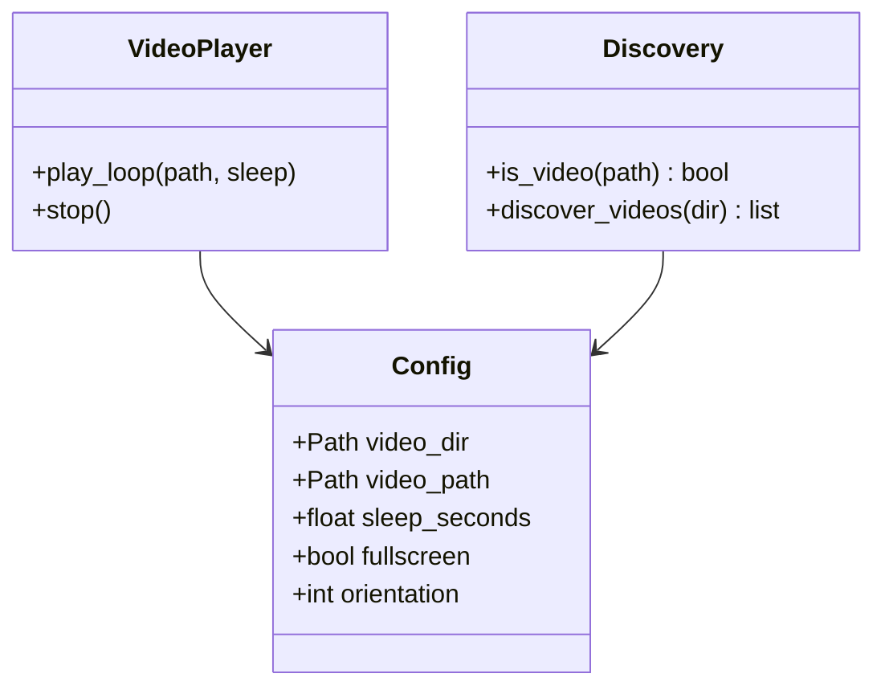

# Components

## Config (`config.py`)

- `Config` dataclass: video_dir, video_path, random_mode, sleep_seconds, fullscreen, window dimensions, orientation, log_level
- `load_config(path, cli_overrides)`: TOML parsing + CLI merge
- `_validate()`: orientation in (0,90,180,270), sleep ≥ 0

## Discovery (`discovery.py`)

- `is_video(path)`: MIME check via python-magic
- `discover_videos(video_dir)`: recursive walk, filter videos, fatal if empty/missing

## VideoPlayer (`player.py`)

- `__init__`: create VLC instance, configure fullscreen/orientation
- `play_loop(video_path, sleep_seconds)`: play → poll for end → sleep → repeat
- `stop()`: stop player, release VLC resources
- Handles VLC unavailability with clear error

## Entry Point (`__main__.py`)

- Parse CLI → load config → setup logging → select video → create player → run loop
- Video selection: specific path > random from directory
- KeyboardInterrupt → player.stop()

## Component Relationships

