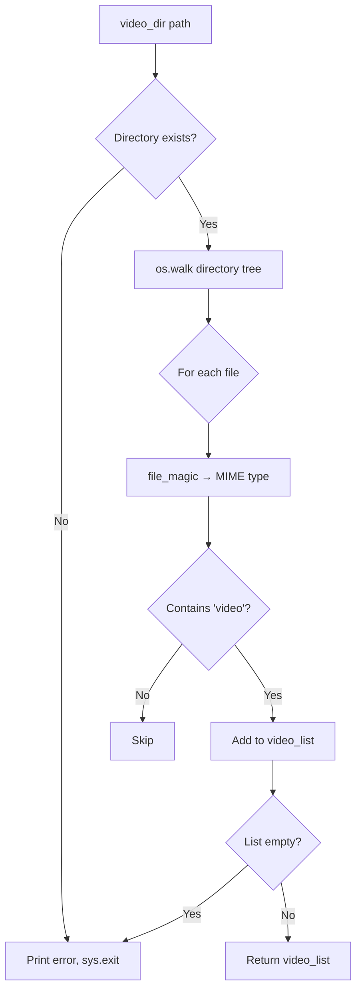

# Data Models

## Runtime Data Structures

The application uses no classes or custom data structures. All state is held in local variables:

| Variable | Type | Scope | Description |
|----------|------|-------|-------------|
| `video_list` | `list[str]` | `generate_video_list()` | Discovered video file paths |
| `player` | `OMXPlayer` | `single_video_player_looper()` | Active player instance |
| `args` | `argparse.Namespace` | `__main__` | Parsed CLI arguments |

## Configuration

All configuration is via CLI arguments — no config file, no environment variables.

| Setting | Source | Default |
|---------|--------|---------|
| Video path | `-v` flag | None |
| Random mode | `-r` flag | False |
| Sleep time | `-s` flag | 0 minutes |
| Test mode | `-t` flag | False |
| Video directory | Hardcoded | `./video/` (CWD-relative) |
| Display orientation | Hardcoded | 180° |
| Test window size | Hardcoded | 720×360 |

## File Discovery



## OMXPlayer Arguments

**Production mode:**
```
["--no-osd", "--loop", "--orientation", "180", "--aspect-mode", "fill"]
```

**Test mode:**
```
["--no-osd", "--loop", "--win", "0, 0, 720, 360"]
```
