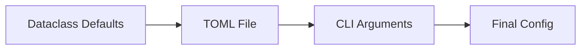

# Data Models

## Config Dataclass

```python
@dataclass
class Config:
    video_dir: Path          # Default: package "video/" dir
    video_path: Path | None  # Specific video (overrides dir)
    random_mode: bool        # Default: False
    sleep_seconds: float     # Default: 0
    fullscreen: bool         # Default: True
    window_width: int        # Default: 720
    window_height: int       # Default: 480
    orientation: int         # Default: 0 (valid: 0, 90, 180, 270)
    log_level: str           # Default: "INFO"
```

## Configuration Precedence



CLI args override TOML, which overrides defaults. Only non-None CLI values are applied.

## File Outputs

None — the application only outputs video to HDMI display. No files written.

## Runtime State

| Component | State | Description |
|-----------|-------|-------------|
| VideoPlayer | `_player` | VLC MediaPlayer instance |
| VideoPlayer | `_instance` | VLC Instance |
| Discovery | return value | `list[Path]` of discovered videos |
