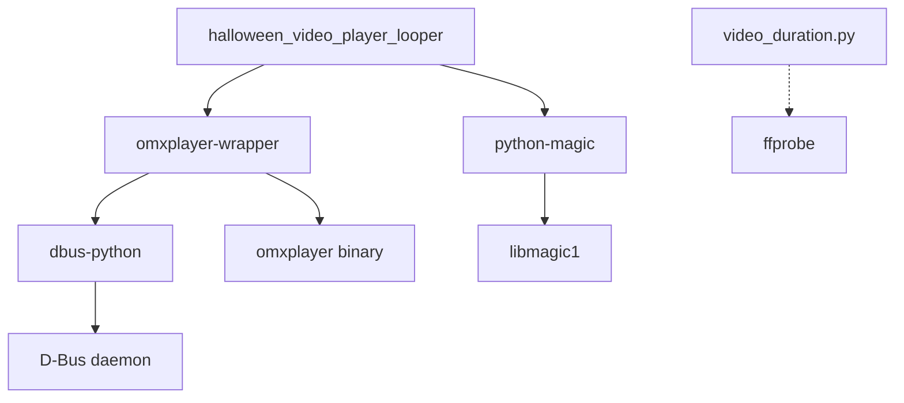

# Dependencies

## Runtime Dependencies (requirements.txt)

| Package | Purpose | Used By |
|---------|---------|---------|
| `omxplayer-wrapper` | OMXPlayer D-Bus control | `single_video_player_looper()` |
| `python-magic` | File MIME type detection | `file_magic()` |
| `dbus-python` | D-Bus communication (omxplayer-wrapper dep) | Indirect |

## Standard Library Usage

| Module | Purpose | Used By |
|--------|---------|---------|
| `argparse` | CLI argument parsing | `__main__` block |
| `os` | Path manipulation, file checks | Multiple functions |
| `sys` | Fatal exit | Multiple functions |
| `random` | Random video selection | `__main__` block |
| `datetime` | Timestamp formatting | `current_time()` |
| `time.sleep` | Playback timing + cooldown | `single_video_player_looper()` |
| `subprocess` | ffprobe execution | `video_duration.py` (orphaned) |
| `json` | ffprobe output parsing | `video_duration.py` (orphaned) |

## System Dependencies

| Binary/Library | Required By | Notes |
|----------------|-------------|-------|
| `omxplayer` | omxplayer-wrapper | **Deprecated** — removed from Pi OS Bullseye+ |
| `libmagic1` | python-magic | System library for MIME detection |
| `ffprobe` (FFmpeg) | video_duration.py | Only for orphaned utility |
| D-Bus daemon | omxplayer-wrapper | Must be running |

## Dependency Graph

## Platform Constraints

- **OMXPlayer**: Only available on Raspberry Pi OS Buster and earlier. Removed in Bullseye (2021). No replacement provided by omxplayer-wrapper.
- **dbus-python**: Requires system D-Bus libraries (`libdbus-1-dev`, `libglib2.0-dev`)
- **python-magic**: Requires `libmagic1` system package (not the PyPI `magic` package — naming conflict)
