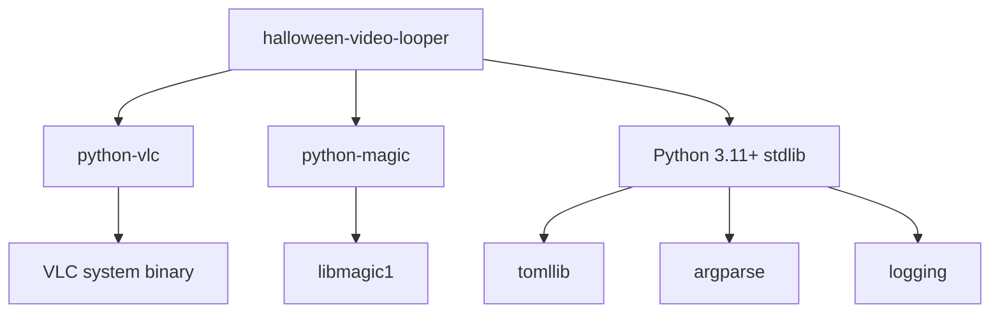

# Dependencies

## Runtime Dependencies

| Package | Purpose | Used By |
|---------|---------|---------|
| `python-vlc` | VLC media player bindings | `player.py` |
| `python-magic` | MIME type detection via libmagic | `discovery.py` |

## Standard Library Usage

| Module | Purpose | Used By |
|--------|---------|---------|
| `tomllib` | TOML config parsing | `config.py` |
| `argparse` | CLI argument parsing | `__main__.py` |
| `logging` | Structured logging | All modules |
| `dataclasses` | Config data structure | `config.py` |
| `pathlib` | File path handling | All modules |
| `random` | Video selection | `__main__.py` |
| `time` | Playback polling + sleep | `player.py` |
| `sys` | Fatal exit | Multiple |

## System Dependencies

| Requirement | Notes |
|-------------|-------|
| VLC (`apt install vlc`) | Required — python-vlc binds to system VLC |
| `libmagic1` | Required by python-magic |
| HDMI display | For video output |

## Dependency Graph

