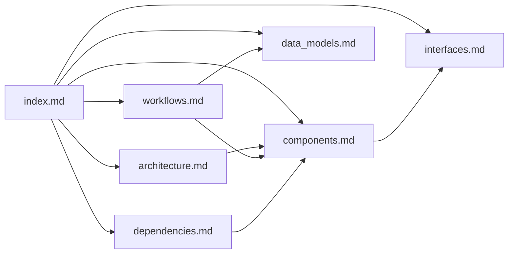

# Documentation Index — Halloween Video Player Looper

## How to Use This Documentation (AI Assistants)

This index is your primary entry point. Start here to determine which file contains the information you need.

**Quick navigation:**
- Architecture questions → `architecture.md`
- What does a function do? → `components.md`
- CLI usage and function signatures → `interfaces.md`
- Configuration and data structures → `data_models.md`
- How does playback work? → `workflows.md`
- What libraries are used? → `dependencies.md`
- Raw codebase facts → `codebase_info.md`
- Known issues and improvements → `review_notes.md`

## Project Summary

A Raspberry Pi video looper for Halloween displays. Plays video files on loop using OMXPlayer (deprecated) with D-Bus control. Single-file procedural Python script with CLI interface. Supports specific video, random selection, test mode (windowed), and configurable sleep between loops.

**Critical constraint**: OMXPlayer was removed from Raspberry Pi OS in Bullseye (2021). This application only works on Pi OS Buster or earlier.

## Documentation Files

| File | Purpose | Consult When... |
|------|---------|-----------------|
| [codebase_info.md](codebase_info.md) | Tech stack, directory structure, entry points | You need factual metadata about the project |
| [architecture.md](architecture.md) | System design, execution modes, playback pattern | You need to understand the overall design |
| [components.md](components.md) | Individual functions and their responsibilities | You need to modify or understand specific code |
| [interfaces.md](interfaces.md) | CLI flags, function signatures, OMXPlayer API | You need to change the interface or add features |
| [data_models.md](data_models.md) | Configuration, file discovery, OMXPlayer args | You need to understand data flow |
| [workflows.md](workflows.md) | Startup, playback loop, shutdown sequences | You need to understand runtime behavior |
| [dependencies.md](dependencies.md) | External libraries, system requirements | You need to update or replace dependencies |
| [review_notes.md](review_notes.md) | Known bugs, gaps, and recommendations | You want to improve the project |

## Relationships Between Files

