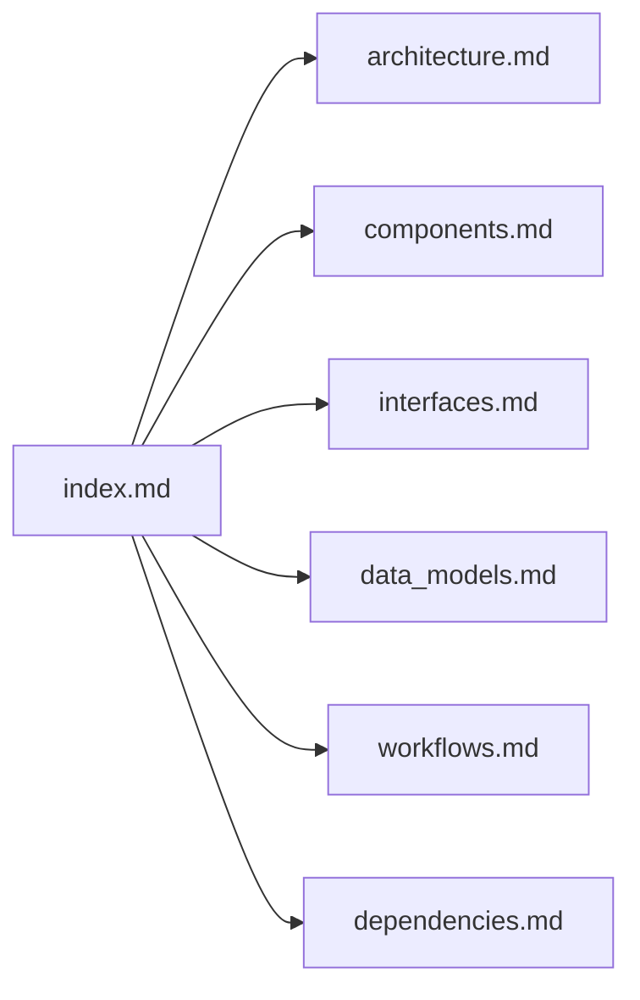

# Documentation Index — Halloween Video Player Looper

## How to Use This Documentation (AI Assistants)

Start here to find the information you need.

**Quick navigation:**
- Architecture questions → `architecture.md`
- What does a component do? → `components.md`
- CLI and API signatures → `interfaces.md`
- Configuration and data structures → `data_models.md`
- How does playback work? → `workflows.md`
- What libraries are used? → `dependencies.md`
- Raw project facts → `codebase_info.md`
- Known gaps → `review_notes.md`

## Project Summary

Raspberry Pi video looper for Halloween displays. Plays a video fullscreen on repeat using VLC (`python-vlc`). Supports random selection from a directory, windowed test mode, configurable orientation and sleep between loops. Python 3.11+ with TOML configuration and CLI overrides.

## Documentation Files

| File | Purpose | Consult When... |
|------|---------|-----------------|
| [codebase_info.md](codebase_info.md) | Tech stack, directory structure, entry points | You need project metadata |
| [architecture.md](architecture.md) | System design, playback loop pattern | You need to understand the design |
| [components.md](components.md) | Module responsibilities | You need to modify specific code |
| [interfaces.md](interfaces.md) | CLI flags, TOML schema, Python APIs | You need to change interfaces |
| [data_models.md](data_models.md) | Config dataclass, precedence rules | You need to understand data flow |
| [workflows.md](workflows.md) | Startup, playback, shutdown sequences | You need to understand runtime |
| [dependencies.md](dependencies.md) | Libraries, system requirements | You need to update deps |
| [review_notes.md](review_notes.md) | Gaps and improvement ideas | You want to enhance the project |

## Relationships

