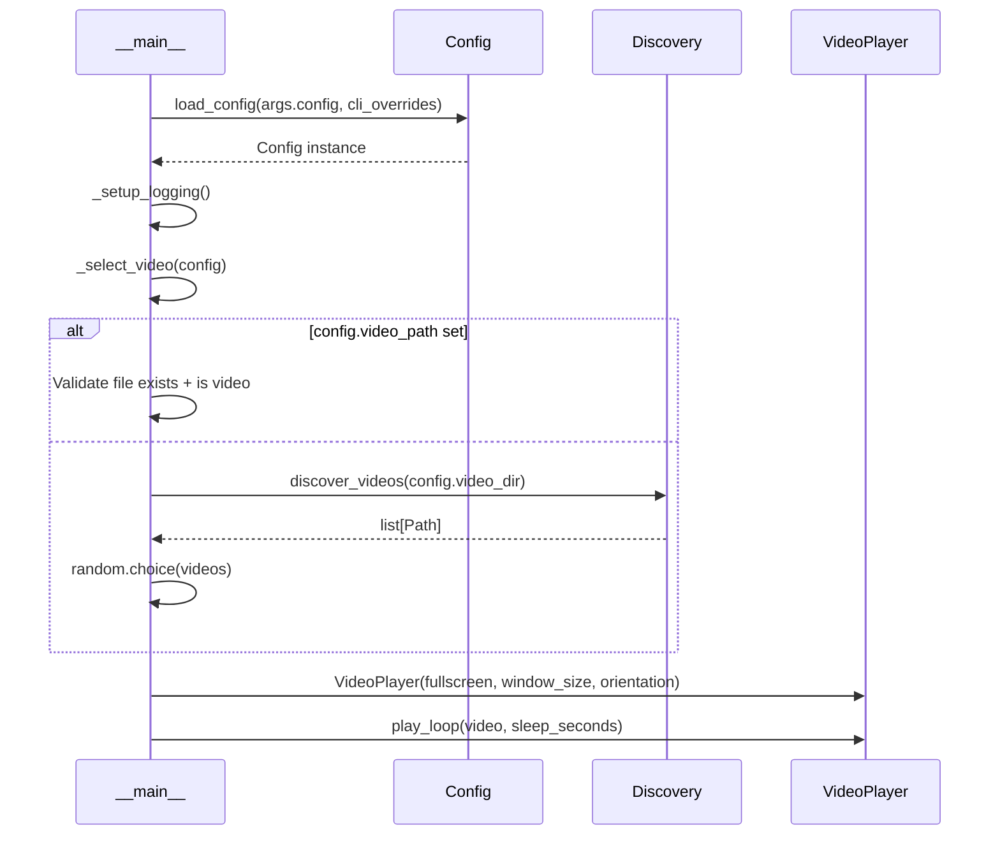
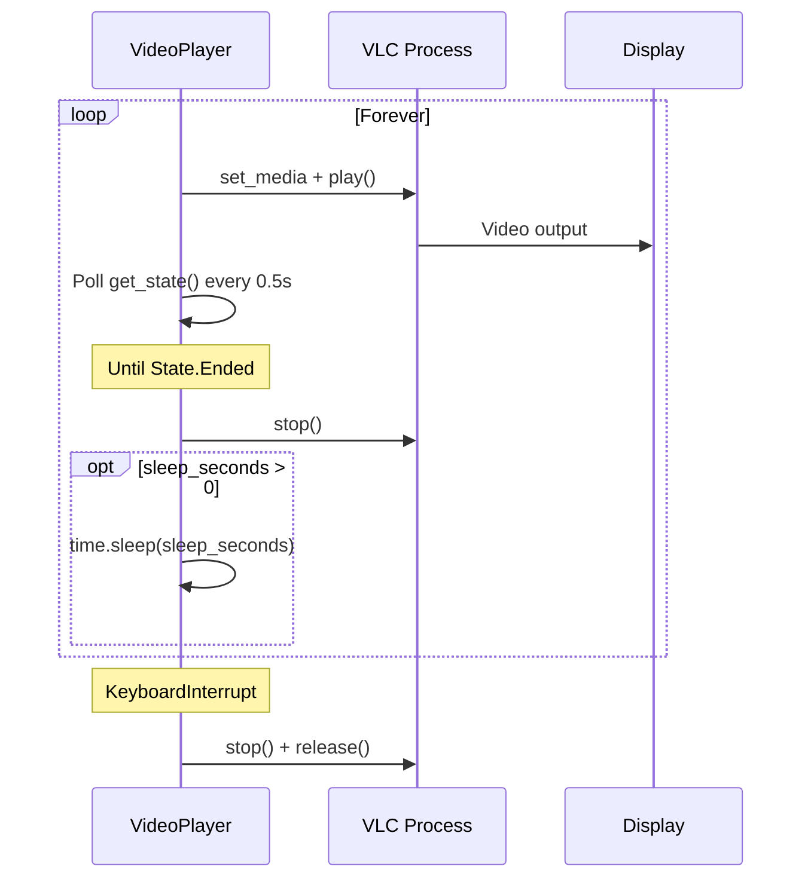

# Workflows

## Application Startup

```mermaid
sequenceDiagram
    participant CLI as __main__
    participant CFG as Config
    participant DISC as Discovery
    participant VP as VideoPlayer

    CLI->>CFG: load_config(args.config, cli_overrides)
    CFG-->>CLI: Config instance
    CLI->>CLI: _setup_logging()
    CLI->>CLI: _select_video(config)
    alt config.video_path set
        CLI->>CLI: Validate file exists + is video
    else
        CLI->>DISC: discover_videos(config.video_dir)
        DISC-->>CLI: list[Path]
        CLI->>CLI: random.choice(videos)
    end
    CLI->>VP: VideoPlayer(fullscreen, window_size, orientation)
    CLI->>VP: play_loop(video, sleep_seconds)
```

## Playback Loop

```mermaid
sequenceDiagram
    participant VP as VideoPlayer
    participant VLC as VLC Process
    participant HDMI as Display

    loop Forever
        VP->>VLC: set_media + play()
        VLC->>HDMI: Video output
        VP->>VP: Poll get_state() every 0.5s
        Note over VP: Until State.Ended
        VP->>VLC: stop()
        opt sleep_seconds > 0
            VP->>VP: time.sleep(sleep_seconds)
        end
    end

    Note over VP: KeyboardInterrupt
    VP->>VLC: stop() + release()
```

## Shutdown

`KeyboardInterrupt` caught in `__main__.main()` → calls `player.stop()` which stops playback and releases VLC instance.
