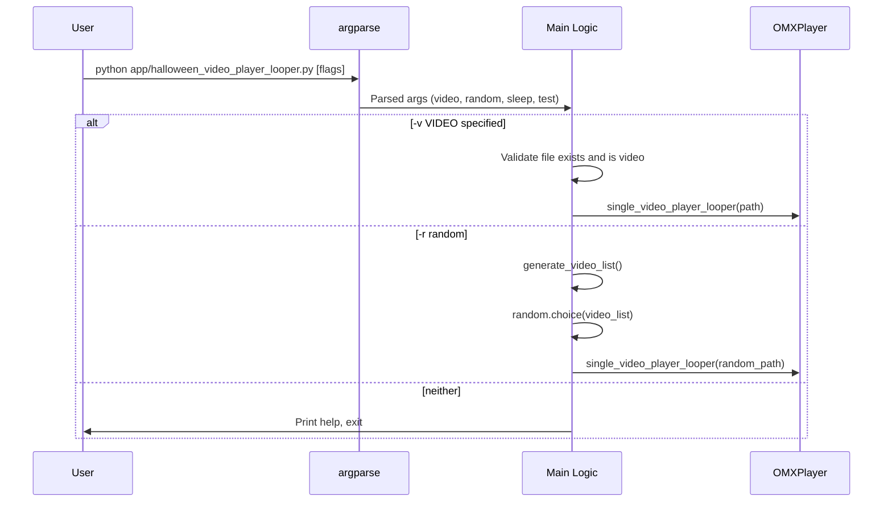
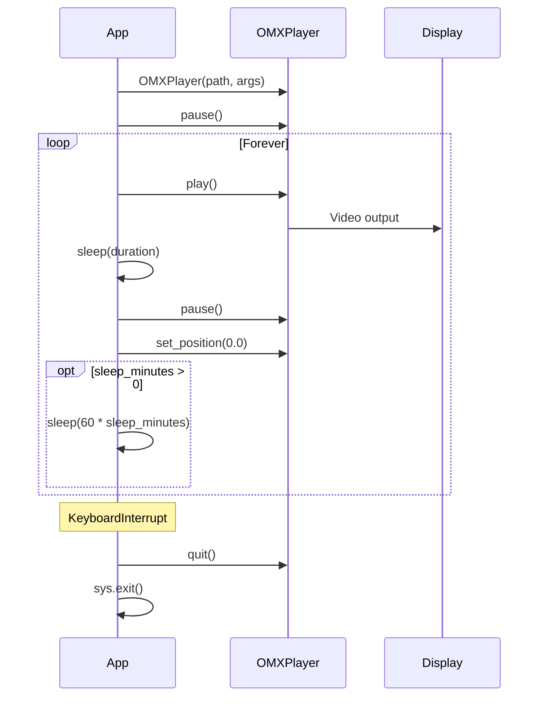

# Workflows

## Application Startup

## Playback Loop

## Video Discovery

1. Resolve video directory (CWD-relative `./video/`)
2. Check directory exists → fatal exit if not
3. Walk directory tree recursively
4. For each file: check MIME type via libmagic
5. Collect files where MIME contains "video"
6. Fatal exit if list is empty
7. Return list of video paths

## Shutdown

Only mechanism: `KeyboardInterrupt` (Ctrl+C)
- Calls `player.quit()` to terminate OMXPlayer process
- Calls `sys.exit()`
